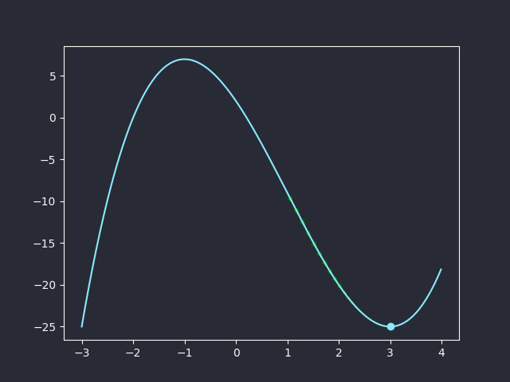
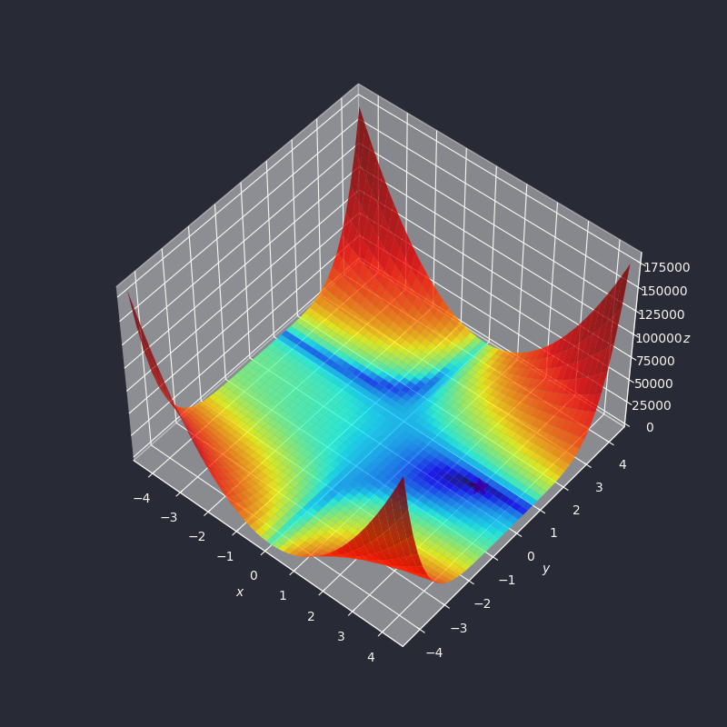
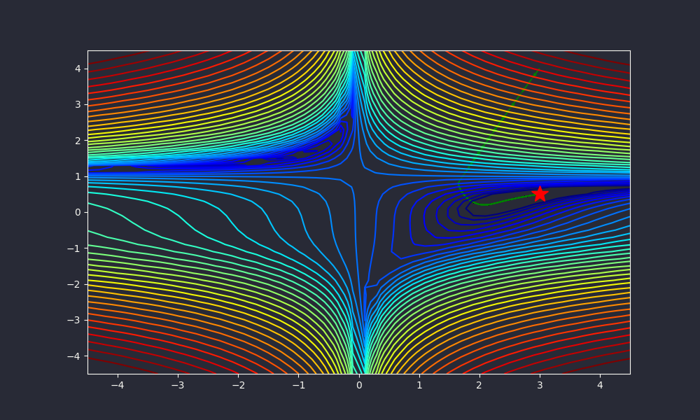

# Gradient Descent
Gradient descent (also often called steepest descent) is a first-order iterative optimization algorithm for finding a local minimum of a differentiable function.

## Basics
Given a function $f(x)$,
$$f(x+\Delta x)-f(x)\approx f^\prime(x)\Delta x$$

Gradient descent algorithm:<br>
Starting from an initial `x`, we update the value of `x` using the following formula:
$$x=x-\alpha f^\prime(x)$$

Code for gradient descent:
```python
def gradient_descent(df, x, alpha=0.01, iterations=100, epsilon=1e-8):
    history = [x]
    for _ in range(iterations):
        if np.max(np.abs(df(x))) < epsilon:
            break
        x = x - alpha * df(x)
        history.append(x)
    return history
```

For example, we want to find the local minimum of $f(x)=x^3-3x^2-9x+2$. Its derivative is $f^\prime(x)=3x^2-6x-9$.
```python
df = lambda x: 3 * x**2 - 6 * x - 9
path = gradient_descent(df, 1, iterations=200)
print(f"Minimum point located at x={path[-1]}")
```
<details open>
<summary>Output</summary>

```
Minimum point located at x=2.999999999256501
```

</details>




Similarly, for multivariate functions:
$$f(x+\Delta x)-f(x)\approx\nabla f(x)\Delta x$$

Example: [Beale's function](https://www.sfu.ca/~ssurjano/beale.html)
$$f(x,y)=(1.5-x+xy)^2+(2.25-x+xy^2)^2+(2.625-x+xy^3)^2$$



Its derivatives:

$$\frac{\partial f(x,y)}{\partial x}=2(1.5-x+xy)(y-1)+2(2.25-x+xy^2)(y^2-1)+2(2.625-x+xy^3)(y^3-1)$$

$$\frac{\partial f(x,y)}{\partial y}=2(1.5-x+xy)x+2(2.25-x+xy^2)(2yx)+2(2.625-x+xy^3)(3y^2x)$$

```python
path = gradient_descent_momentum(df, x0, alpha=0.000005, iterations=300000)
print(f"Minimum point located at (x, y)={tuple(path[-1])}")
```
<details open>
<summary>Output</summary>

```
Minimum point located at (x, y)=(2.707358277261343, 0.4168917147021121)
```

</details>


Note: Beale's function is a gradient descent testing function, meaning that it is not easy for gradient descent algorithms. The learning rate $\alpha$ and iterations need to be tuned manually.

Its gradient descent path:


## Momentum
In momentum-based gradient descent, we will consider the previous updates in derivatives.

Let $v_{t-1}$ be the last update vector. The current update vector will be:
$$v_t=\gamma v_{t-1}+\alpha\nabla f(x)$$

The update vector is used to update the current `x`:
$$x=x-v_t$$

$v_t$ is called the **momentum**.

```python
def gradient_descent_momentum(
    df, x, alpha=0.01, gamma=0.8, iterations=100, epsilon=1e-6
):
    history = [x]
    v = np.zeros_like(x)
    for _ in range(iterations):
        if np.max(np.abs(df(x))) < epsilon:
            break
        v = gamma * v + alpha * df(x)
        x = x - v
        history.append(x)
    return history
```

```python
path = gradient_descent_momentum(df, x0, alpha=0.000005, iterations=300000)
print(f"Minimum point located at (x, y)={tuple(path[-1])}")
```
<details open>
<summary>Output</summary>

```
Minimum point located at (x, y)=(2.707358277261343, 0.4168917147021121)
Minimum point located at (x, y)=(2.9632463255505734, 0.49067782206377325)
```

</details>



