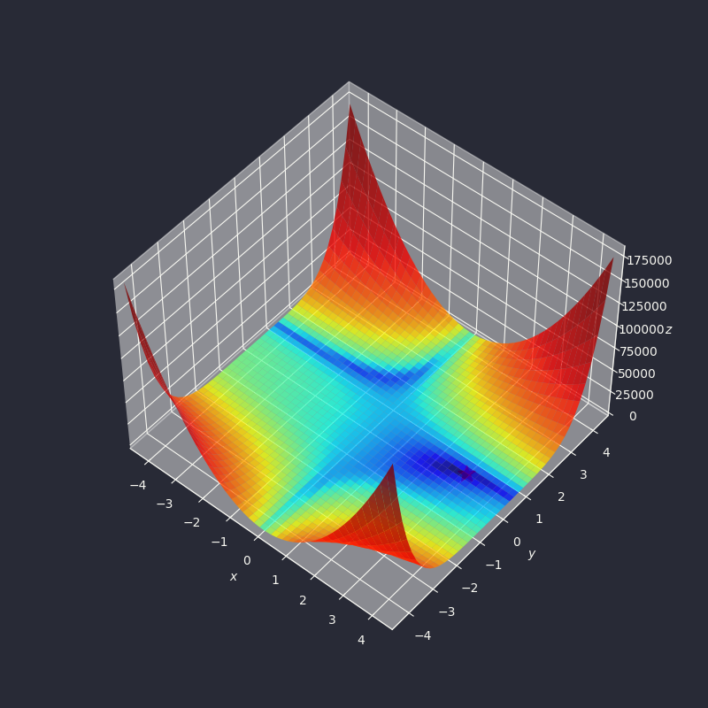

# Gradient Descent
Gradient descent (also often called steepest descent) is a first-order iterative optimization algorithm for finding a local minimum of a differentiable function.

## Basics
Given a function $f(x)$,
$$f(x+\Delta x)-f(x)\approx f^\prime(x)\Delta x$$

Gradient descent algorithm:<br>
Starting from an initial `x`, we update the value of `x` using the following formula:
$$x=x-\alpha f^\prime(x)$$

Code for gradient descent:
```python
${{ gradient_descent }}
```

For example, we want to find the local minimum of $f(x)=x^3-3x^2-9x+2$. Its derivative is $f^\prime(x)=3x^2-6x-9$.
```python
${{ gradient_descent_1 }}
```
$[[ +gradient_descent.snippets.gradient_descent_1 ]]


Similarly, for multivariate functions:
$$f(x+\Delta x)-f(x)\approx\nabla f(x)\Delta x$$

Example: [Beale's function](https://www.sfu.ca/~ssurjano/beale.html)
$$f(x,y)=(1.5-x+xy)^2+(2.25-x+xy^2)^2+(2.625-x+xy^3)^2$$



Its derivatives:

$$\frac{\partial f(x,y)}{\partial x}=2(1.5-x+xy)(y-1)+2(2.25-x+xy^2)(y^2-1)+2(2.625-x+xy^3)(y^3-1)$$

$$\frac{\partial f(x,y)}{\partial y}=2(1.5-x+xy)x+2(2.25-x+xy^2)(2yx)+2(2.625-x+xy^3)(3y^2x)$$

```python
${{ beale_function_gradient_descent }}
```
$[[ +gradient_descent.snippets.gradient_descent_beale_1 ]]

Note: Beale's function is a gradient descent testing function, meaning that it is not easy for gradient descent algorithms. The learning rate $\alpha$ and iterations need to be tuned manually. The true minimum for the function is at $(x,y)=(3,0.5)$.

Its gradient descent path:


## Momentum
In momentum-based gradient descent, we will consider the previous updates in derivatives.

Let $v_{t-1}$ be the last update vector. The current update vector will be:
$$v_t=\gamma v_{t-1}+\alpha\nabla f(x)$$

The update vector is used to update the current `x`:
$$x=x-v_t$$

$v_t$ is called the **momentum**.

```python
${{ gradient_descent_momentum }}
```

```python
${{ beale_function_gradient_descent_momentum }}
```
$[[ +gradient_descent.snippets.gradient_descent_beale_2 ]]


## AdaGrad
In multivariate function, e.g. $f(x_1,x_2)$, the value of partial derivative for each variable can have huge differences. In this situation, if we simply use:

$$x_1=x_1-\alpha\frac{\partial f}{\partial x_1}$$

$$x_2=x_2-\alpha\frac{\partial f}{\partial x_2}$$

This may lead to oscillations.

Here, Adaptive Gradient algorithm divides the derivative by a value $G$ based on the cumulative update of each variable:

$$x_1=x_1-\alpha\frac{1}{G_1}\frac{\partial f}{\partial x_1}$$

$$x_2=x_2-\alpha\frac{1}{G_2}\frac{\partial f}{\partial x_2}$$

Denote $g_{t,i}=\nabla_\theta f(x_{t,i})$ as the value of $\frac{\partial f}{\partial x_i}$ at the $t$-th iteration. $G_{t,i}$ is obtained by:

$$G_{t,i}=\sqrt{\sum_{t^\prime=1}^tg_{t^\prime,i}^2}$$

To prevent division by 0 error, we add a small $\epsilon$ in the denominator in the formula:

$$x_{t+1,i}=x_{t,i}-\alpha\frac{1}{\sqrt{\sum_{t^\prime=1}^tg_{t^\prime,i}^2}+\epsilon}g_{t,i}$$

We can even write the above in vector form:

$$x_{t+1}=x_t-\alpha\frac{1}{\sqrt{\sum_{t^\prime=1}^tg_{t^\prime}^2}+\epsilon}\odot g_t$$

```python
${{ gradient_descent_adagrad }}
```

```python
${{ beale_function_gradient_descent_adagrad }}
```
$[[ +gradient_descent.snippets.gradient_descent_adagrad ]]


Unfortunately in this case, the algorithm finds a local minimum point that is not the global minimum solution.

## AdaDelta

In AdaGrad, the denominator $G_t$ can get larger and larger over time, making the gradient update smaller, or even halting it entirely. To overcome this issue, in AdaDelta, the sum of gradients is recursively defined as a decaying average of all past squared gradients. The running average $E[g^2]_t$ at timestep $t$ is:

$$E[g^2]_t=\rho E[g^2]_{t-1}+(1-\rho)g_t^2$$

AdaDelta takes the form:

$$RMS[g]_t=\sqrt{E[g^2]_t+\epsilon}$$

$$x_{t+1}=x_t-\frac{\alpha}{RMS[g]_t}g_t$$

The authors observe that the units in the weight update do not match, i.e. the update should have the same hypothetical units as the weights. To realize this, they use the root mean squared error for parameter updates:

$$E[\Delta x^2]_t=\rho E[\Delta x^2]_{t-1}+(1-\rho)\Delta x_t^2$$

$$RMS[\Delta x]_t=\sqrt{E[\Delta x^2]_t+\epsilon}$$

The final AdaDelta formula is:

$$x_{t+1}=x_t-\frac{RMS[\Delta x]_{t-1}}{RMS[g]_t}g_t$$

```python
${{ gradient_descent_adadelta }}
```

```python
${{ beale_function_gradient_descent_adadelta }}
```
$[[ +gradient_descent.snippets.gradient_descent_adadelta ]]


## RMSprop

RMSprop is similar to Momentum:

$$v_t=\beta v_{t-1}+(1-\beta)\nabla f(x)^2$$

$$x=x-\alpha\frac{1}{\sqrt{v_t}+\epsilon}\nabla f(x)$$

```python
${{ gradient_descent_rmsprop }}
```

```python
${{ beale_function_gradient_descent_rmsprop }}
```
$[[ +gradient_descent.snippets.gradient_descent_rmsprop ]]


## Adam

Adam is similar to RMSprop: it has a decaying moving average of square root of past gradients ($v_t$). It is also similar to Momentum: it has a decaying moving average of past gradients ($m_t$). We can view Momentum's behavior as a ball moving along the gradient, and view Adam's behavior as a ball with higher friction moving along the gradient.

Denote $m_t$ as the moving average of gradient, and $v_t$ as the moving average of the square of the gradient.
$$m_t=\beta_1 m_{t-1}+(1-\beta_1)g_t$$

$$v_t=\beta_2 v_{t-1}+(1-\beta_2)g_t^2$$

The authors observe that when the decay is small (i.e. $\beta_1$ and $\beta_2$ are close to 1), $m_t$ and $v_t$ will tend to 0 initially. They introduce the correction formula:
$$\hat{m_t}=\frac{m_t}{1-\beta_1^t}$$

$$\hat{v_t}=\frac{v_t}{1-\beta_2^t}$$

The final update formula is:

$$\theta_{t+1}=\theta_t-\frac{\eta}{\sqrt{\hat{v_t}+\epsilon}}\hat{m_t}$$

```python
${{ gradient_descent_adam }}
```

```python
${{ beale_function_gradient_descent_adam }}
```
$[[ +gradient_descent.snippets.gradient_descent_adam ]]


