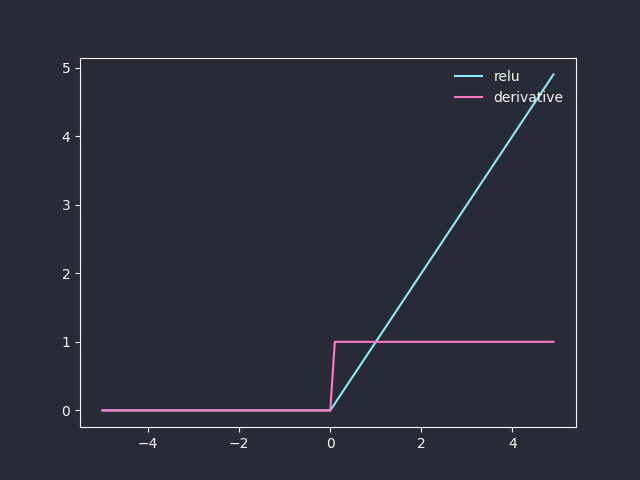

# Neural Network Introduction

## Perceptron
Perceptron is a simple function that can perform binary classification. Logistic regression uses the sigmoid function $\sigma$ to produce a probability $\sigma(xw)$. Perceptron on the other hand uses a threshold value to produce a value either 0 or 1: $\text{sgn}_b(xw)$.

$$\text{sgn}_b(z)=\left\lbrace\begin{aligned}1 && \text{if }z\geq b \\
0 && \text{otherwise}\end{aligned}\right.$$

Denote $f_w(x)=\text{sgn}_b(xw)$ as the perceptron function, where $x$ is the input and $w$ is the weight. Then,

$$f_w(x)=\left\lbrace\begin{aligned}1 && \text{if }\sum_jw_jx_j\geq b \\
0 && \text{otherwise}\end{aligned}\right.$$

which can be rewritten into:

$$f_w(x)=\left\lbrace\begin{aligned}1 && \text{if }\sum_jw_jx_j+b\geq 0 \\
0 && \text{otherwise}\end{aligned}\right.=\text{sgn}(xw+b)$$

## Neuron
Neuron accepts multiple inputs, performs weighted sum and then through a linear or non-linear activation function, producing one or more output values.

$$a=g\left(\sum_jw_jx_j\right)$$

$x_j$ is an input, $w_j$ is its respective weight, and $g$ is the activation function.

## Activation Functions

$\text{sign}(x)$:

```python
def sign(x):
    return np.array(x > 0, dtype=int)

def grad_sign(x):
    return np.zeros_like(x)
```


$\tanh(x)$:

$$\tanh(x)=\frac{e^x-e^{-x}}{e^x+e^{-x}}$$

$$\tanh^\prime(x)=1-\tanh^2(x)$$

```python
def grad_tanh(x):
    a = np.tanh(x)
    return 1 - a**2
```


ReLU (Rectified Linear Unit):

$$\text{ReLU}(x)=\left\lbrace\begin{aligned}x && \text{if } x>0 \\
0 && \text{otherwise}\end{aligned}\right.$$

$$\text{ReLU}'(x)=\left\lbrace\begin{aligned}1 && \text{if } x>0 \\
0 && \text{otherwise}\end{aligned}\right.$$

```python
def relu(x):
    return np.maximum(0, x)

def grad_relu(x):
    return 1. * (x > 0)
```



Leaky ReLU:

$$\text{LeakyReLU}(x)=\left\lbrace\begin{aligned}x && \text{if } x>0 \\
ax && \text{otherwise}\end{aligned}\right.$$

where a is a small constant (typically 0.01).

$$\text{LeakyReLU}'(x)=\left\lbrace\begin{aligned}1 && \text{if } x>0 \\
a && \text{otherwise}\end{aligned}\right.$$

```python
def leakyRelu(x, a=0.2):
    y = np.copy(x)
    y[y < 0] *= a
    return y

def grad_leakyRelu(x, a=0.2):
    return np.clip(x > 0, a, 1.0)
```


## Neural Network

A neural network is composed of many perceptrons to represent a complicated function. It has an input layer and an output layer. In between, there are one or more hidden layers.


Take the above 2-layered neural network as an example. It defines a function $f: \mathbb{R}^D \rightarrow \mathbb{R}^K$, where D is the dimensionality of input and K is the dimensionality of vector $f(x)$. Assume that the activation functions for the first layer are all $g^{[1]}$. Each perception in the hidden layer takes $x=(x_1, x_2)$ and produces an output. Their outputs form a vector $a^{[1]}=(a_1^{[1]}\quad a_2^{[1]}\quad a_3^{[1]}\quad a_4^{[1]})$.

$$a_1^{[1]} = g^{[1]}(x_1W_{11}^{[1]} + x_2W_{21}^{[1]}+b_1^{[1]})$$

$$a_2^{[1]} = g^{[1]}(x_1W_{12}^{[1]} + x_2W_{22}^{[1]}+b_2^{[1]})$$

$$a_3^{[1]} = g^{[1]}(x_1W_{13}^{[1]} + x_2W_{23}^{[1]}+b_3^{[1]})$$

$$a_4^{[1]} = g^{[1]}(x_1W_{14}^{[1]} + x_2W_{24}^{[1]}+b_4^{[1]})$$

Write

$$W^{[1]}=\left[\begin{matrix}W_{11}^{[1]} & W_{12}^{[1]} & W_{13}^{[1]} & W_{14}^{[1]} \\
W_{21}^{[1]} & W_{22}^{[1]} & W_{23}^{[1]} & W_{24}^{[1]}\end{matrix}\right]$$

$$b^{[1]}=(b_1^{[1]}\quad b_2^{[1]}\quad b_3^{[1]}\quad b_4^{[1]})$$

Then the output of the first layer can be written as $a^{[1]}=g^{[1]}(xW^{[1]}+b^{[1]})$.

Similarly for the second layer, we write

$$W^{[2]}=\left[\begin{matrix}W_{11}^{[2]} & W_{12}^{[2]} & W_{13}^{[2]} \\
W_{21}^{[2]} & W_{22}^{[2]} & W_{23}^{[2]} \\
W_{31}^{[2]} & W_{32}^{[2]} & W_{33}^{[2]} \\
W_{41}^{[2]} & W_{42}^{[2]} & W_{43}^{[2]} \end{matrix}\right]$$

$$b^{[2]}=(b_1^{[2]}\quad b_2^{[2]}\quad b_3^{[2]})$$

The output of the second layer can be written as $a^{[2]}=g^{[2]}(a^{[1]}W^{[2]}+b^{[2]})$.

The whole neural network can be represented as $f(x)$:

$$f(x)=g^{[2]}\left(\left(g^{[1]}(xW^{[1]}+b^{[1]})\right)W^{[2]}+b^{[2]}\right)$$

The calculation sequence $x\rightarrow z^{[1]}\rightarrow a^{[1]}\rightarrow z^{[2]}\rightarrow a^{[2]}$ is called forward propagation.

For $m$ samples $x^{(i)}$, their features form a matrix $X$:

$$X=\begin{bmatrix}x^{(1)}\\
x^{(2)}\\
\vdots\\
x^{(m)}\end{bmatrix}$$

Let

$$Z^{[l]}=\begin{bmatrix}z^{(1)[l]} \\
z^{(2)[l]} \\
\vdots \\
z^{(m)[l]}\end{bmatrix},\;A^{[l]}=\begin{bmatrix}a^{(1)[l]} \\
a^{(2)[l]} \\
\vdots \\
a^{(m)[l]}\end{bmatrix}$$

where $z^{(i)[l]}$ is the weighted sum for sample $i$ in $l$-th layer, and $a^{(i)[l]}$ is the activation value for sample $i$ in $l$-th layer.

The forward propagation of the samples can then be written as

$$\begin{aligned}Z^{[l]}&=A^{[l-1]}W^{[l]}+b^{[l]}\\
A^{[l]}&=g^{[l]}(Z^{[l]})\end{aligned}$$

Example:

```python
X = np.array([[1.0, 2.0], [3.0, 4.0]])
W1 = np.array([[0.1, 0.3, 0.5, 0.2], [0.4, 0.6, 0.7, 0.1]])
b1 = np.array([0.1, 0.2, 0.3, 0.4])

print(f"{X.shape = }")
print(f"{W1.shape = }")
print(f"{b1.shape = }")

# First layer
Z1 = np.dot(X, W1) + b1
A1 = sigmoid(Z1)
print(f"{Z1 = }")
print(f"{A1 = }")

W2 = np.array([[0.1, 1.4, 0.2], [2.5, 0.6, 0.3], [1.1, 0.7, 0.8], [0.3, 1.5, 2.1]])
b2 = np.array([0.1, 2, 0.3])
print(f"{A1.shape = }")
print(f"{W2.shape = }")
print(f"{b2.shape = }")

# Second layer
Z2 = np.dot(A1, W2) + b2
A2 = sigmoid(Z2)
print(f"{Z2 = }")
print(f"{A2 = }")
```

<details>
<summary>Output</summary>

```
X.shape = (2, 2)
W1.shape = (2, 4)
b1.shape = (4,)
Z1 = array([[1. , 1.7, 2.2, 0.8],
       [2. , 3.5, 4.6, 1.4]])
A1 = array([[0.73105858, 0.84553473, 0.90024951, 0.68997448],
       [0.88079708, 0.97068777, 0.9900482 , 0.80218389]])
A1.shape = (2, 4)
W2.shape = (4, 3)
b2.shape = (3,)
Z2 = array([[3.4842095 , 5.19593923, 2.86901816],
       [3.94450732, 5.71183814, 3.24399047]])
A2 = array([[0.97023513, 0.9944915 , 0.94629347],
       [0.98100697, 0.99670431, 0.96245657]])
```

</details>


#
