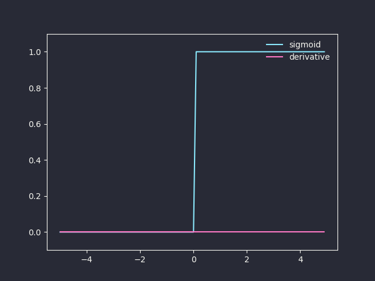
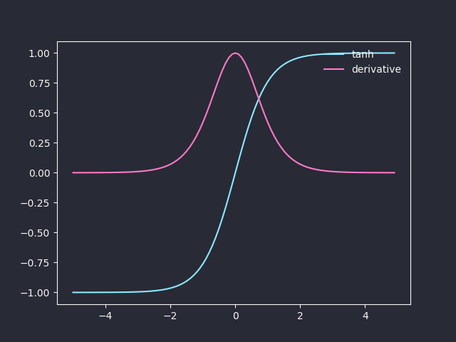
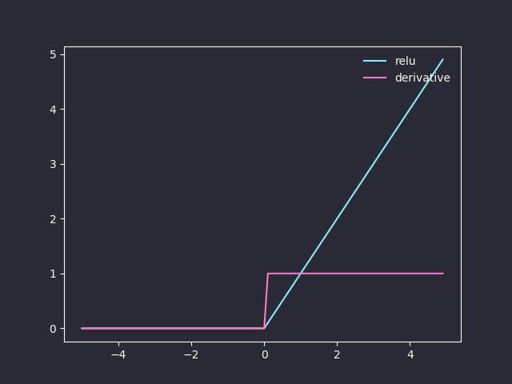
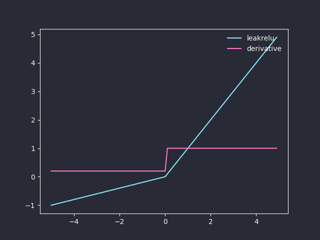

# Neural Network Introduction

## Perceptron
Perceptron is a simple function that can perform binary classification. Logistic regression uses the sigmoid function $\sigma$ to produce a probability $\sigma(xw)$. Perceptron on the other hand uses a threshold value to produce a value either 0 or 1: $\text{sgn}_b(xw)$.

$$\text{sgn}_b(z)=\left\{\begin{aligned}1 && \text{if }z\geq b \\
0 && \text{otherwise}\end{aligned}\right.$$

Denote $f_w(x)=\text{sgn}_b(xw)$ as the perceptron function, where $x$ is the input and $w$ is the weight. Then,

$$f_w(x)=\left\{\begin{aligned}1 && \text{if }\sum_jw_jx_j\geq b \\
0 && \text{otherwise}\end{aligned}\right.$$

which can be rewritten into:

$$f_w(x)=\left\{\begin{aligned}1 && \text{if }\sum_jw_jx_j+b\geq 0 \\
0 && \text{otherwise}\end{aligned}\right.=\text{sgn}(xw+b)$$

## Neuron
Neuron accepts multiple inputs, performs weighted sum and then through a linear or non-linear activation function, producing one or more output values.

$$a=g\left(\sum_jw_jx_j\right)$$

$x_j$ is an input, $w_j$ is its respective weight, and $g$ is the activation function.

## Activation Functions

$\text{sign}(x)$:

```python
${{ sign_activation }}
```



$\tanh(x)$:

$$\tanh(x)=\frac{e^x-e^{-x}}{e^x+e^{-x}}$$

$$\tanh^\prime(x)=1-\tanh^2(x)$$

```python
${{ tanh_activation }}
```



ReLU (Rectified Linear Unit):

$$\text{ReLU}(x)=\left\{\begin{aligned}x && \text{if } x>0 \\
0 && \text{otherwise}\end{aligned}\right.$$

$$\text{ReLU}'(x)=\left\{\begin{aligned}1 && \text{if } x>0 \\
0 && \text{otherwise}\end{aligned}\right.$$

```python
${{ relu_activation }}
```



Leaky ReLU:

$$\text{LeakyReLU}(x)=\left\{\begin{aligned}x && \text{if } x>0 \\
ax && \text{otherwise}\end{aligned}\right.$$

where a is a small constant (typically 0.01).

$$\text{LeakyReLU}'(x)=\left\{\begin{aligned}1 && \text{if } x>0 \\
a && \text{otherwise}\end{aligned}\right.$$

```python
${{ leaky_relu_activation }}
```


