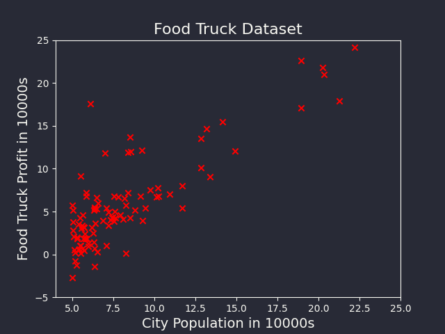
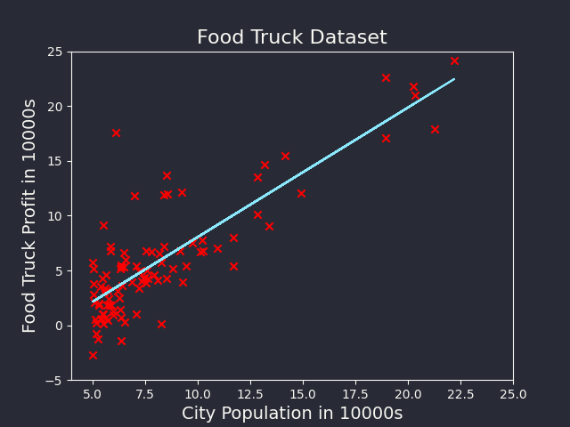
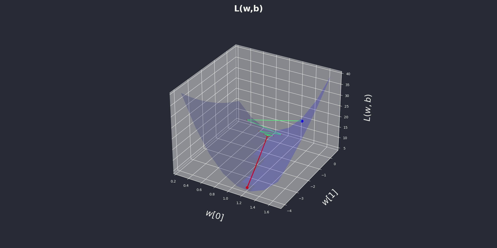
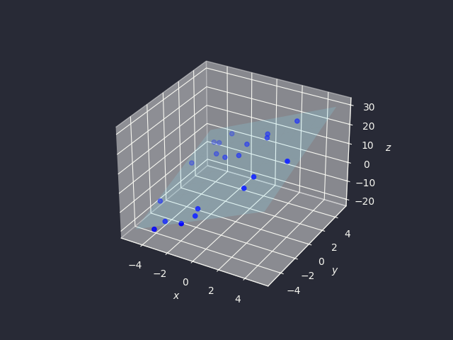
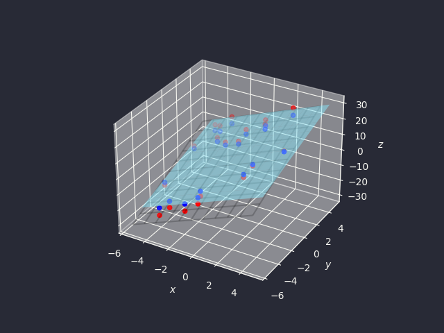
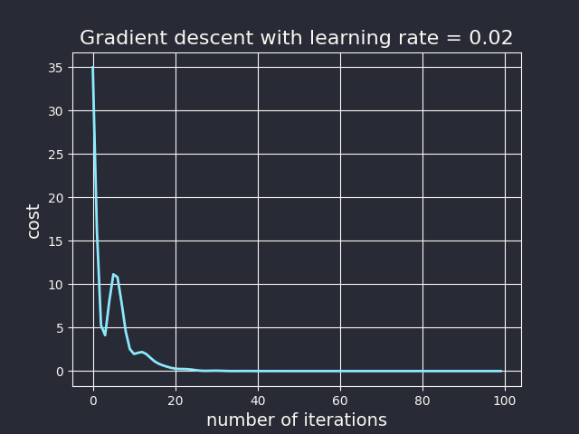

# Linear Regression

We assume a linear relationship between data $x$ and label $y$:
$$y=f(x)=wx+b$$

We call $w$ the weight and $b$ the bias.

We want the loss function $L(w, b)$ to be as small as possible:
$$L=\frac{1}{m}\sum_{i=1}^m(f^{(i)}-y^{(i)})^2=\frac{1}{m}\sum_{i=1}^m(wx^{(i)}+b-y^{(i)})^2$$

For the sake of cleaner computations, we usually divide the loss function by 2:
$$L(w,b)=\frac{1}{2m}\sum_{i=1}^m(f^{(i)}-y^{(i)})^2=\frac{1}{2m}\sum_{i=1}^m(wx^{(i)}+b-y^{(i)})^2$$

We want to find $w$ and $b$ through linear regression.

## Normal equation

$$\frac{\partial L}{\partial w}=\frac{1}{2m}\frac{\partial(\sum(wx^{(i)}+b-y^{(i)})^2)}{\partial w}=\frac{1}{m}\sum(wx^{(i)}+b-y^{(i)})x^{(i)}$$

$$\frac{\partial L}{\partial b}=\frac{1}{2m}\frac{\partial(\sum(wx^{(i)}+b-y^{(i)})^2)}{\partial b}=\frac{1}{m}\sum(wx^{(i)}+b-y^{(i)})$$

For $L$ to be minimum, the following equations must be satisfied:

$$\frac{\partial L}{\partial w}=\sum(wx^{(i)}+b-y^{(i)})x^{(i)}=0$$

$$\frac{\partial L}{\partial b}=\sum(wx^{(i)}+b-y^{(i)})=0$$

Denote
$$X=\left(\begin{matrix}1&w^{(1)}\\1&x^{(2)}\\1&\vdots\\1&w^{(m)}\end{matrix}\right),\qquad W=\left(\begin{matrix}b\\w\end{matrix}\right),\qquad y=\left(\begin{matrix}y^{(1)}\\y^{(2)}\\\vdots\\y^{(m)}\end{matrix}\right)$$

The equations can be rewritten as:
$$\left(\begin{matrix}1&1&\cdots&1\\x^{(1)}&x^{(2)}&\cdots&x^{(m)}\end{matrix}\right)\left(\begin{matrix}b+wx^{(1)}-y^{(1)}\\b+wx^{(2)}-y^{(2)}\\\vdots\\b+wx^{(m)}-y^{(m)}\end{matrix}\right)=0$$
$$X^T(XW-y)=0$$
$$X^XW=x^Ty$$
$$W=(X^X)^{-1}X^Ty$$

Therefore,
$$\left(\begin{matrix}b\\w\end{matrix}\right)=(X^X)^{-1}X^Ty$$

### Example
We have a small dataset:



We can use normal equation to find $w$ and $b$ in $f(x)=wx+b$ that best fit the data:
```python
X = np.ones((len(train_x), 2))
X[:, 1] = train_x
y = train_y

b, w = np.linalg.inv(X.T @ X) @ (X.T @ y)
print(f"{w=}, {b=}")
```
<details open>
<summary>Output</summary>

```
w=1.1930336441895992, b=-3.8957808783119106
```

</details>


## Gradient Descent
As normal equation involves computing matrix inverse, using normal equation is slow for datasets with a lot of samples or a lot of features. Instead, we can apply gradient descent algorithm to find the minimum for the loss function $L$.

Starting from $(w_0, b_0)$, the update formulae:
$$w:=w-\alpha\frac{\partial L}{\partial w}$$
$$b:=w-\alpha\frac{\partial L}{\partial b}$$

Denote
$$x=\left(\begin{matrix}
x^{(1)} \\
x^{(2)} \\
 \vdots \\
  x^{(m)}
\end{matrix}\right),\qquad y=\left(\begin{matrix}
y^{(1)} \\
y^{(2)} \\
 \vdots \\
  y^{(m)}
\end{matrix}\right),\qquad b=\left(\begin{matrix}
b \\
b \\
 \vdots \\
 b
\end{matrix}\right)$$

We can write
$$\frac{\partial L}{\partial w}=\text{mean}((wx+b-y)\odot x)$$
$$\frac{\partial L}{\partial b}=\text{mean}(wx+b-y)$$

Code to use gradient descent algorithm to solve linear regression:
```python
def linear_regression(x, y, w, b, alpha=0.01, iterations=100, epsilon=1e-9):
    history = []
    for _ in range(iterations):
        dw = np.mean((w * x + b - y) * x)
        db = np.mean(w * x + b - y)
        if abs(dw) < epsilon and abs(db) < epsilon:
            break
        w -= alpha * dw
        b -= alpha * db
        history.append([w, b])
    return history
```

### Example
Continuing from our previous example, we can use gradient descent to find $w$ and $b$ that best fit the data:
```python
w, b = 0, 0
history = linear_regression(X, y, w, b, alpha=0.02, iterations=1000)
w, b = history[-1]
print(f"{w=}, {b=}")
```
<details open>
<summary>Output</summary>

```
w=1.1822480052540145, b=-3.7884192615511796
```

</details>




We can plot the loss function to see how the loss changes throughout the process:



# Multivariate linear regression
Assume that now our dataset has $K$ features: $x=\left(\begin{matrix}x_1&x_2&\cdots&x_K\end{matrix}\right)$. The coefficient for each of the features can be grouped into vector form: $w=\left(\begin{matrix}w_1&w_2&\cdots&w_K\end{matrix}\right)$. The objective function is now
$$f(x)=\left(\begin{matrix}x_1&x_2&\cdots&x_K\end{matrix}\right)\left(\begin{matrix}w_1\\w_2\\\vdots\\w_K\end{matrix}\right)+b=xw+b$$

To simplify the equation further, we can write $b=w_0$. Let $w=\left(\begin{matrix}w_0&w_1&w_2&\cdots&w_K\end{matrix}\right)$ and $x=\left(\begin{matrix}1&x_1&x_2&\cdots&x_K\end{matrix}\right)$. Then
$$f_w(x)=\left(\begin{matrix}1&x_1&x_2&\cdots&x_K\end{matrix}\right)\left(\begin{matrix}w_0\\w_1\\w_2\\\vdots\\w_K\end{matrix}\right)=xw$$

If we have $m$ number of data points in the dataset, we can put them into a matrix:
$$X=\left(\begin{matrix}x^{(1)}\\x^{(2)}\\\vdots\\x^{(m)}\end{matrix}\right)=\left(\begin{matrix}x_0^{(1)}&x_1^{(1)}&\cdots&x_K^{(1)}\\x_0^{(2)}&x_1^{(2)}&\cdots&x_K^{(2)}\\\vdots&\vdots&&\vdots\\x_0^{(m)}&x_1^{(m)}&\cdots&x_K^{(m)}\end{matrix}\right)$$
$$f_w(X)=Xw$$

The loss function is the same as before:
$$L(w)=\frac{1}{2m}\sum_{i=1}^m(f_w(x^{(i)})-y^{(i)})^2$$
We want to find the minimum solution $w^\ast$ for the loss function. It must satisfy for all $j$:
$$\left.\frac{\partial L(w)}{\partial w_j}\right|_{w^\ast}=0$$

## Normal equation
Let $f^{(i)}=f_w(x^{(i)})=x^{(i)}w$ and $\delta^{(i)}=f^{(i)}-y^{(i)}$. By Chain rule,
$$\begin{aligned}\frac{\partial L(w)}{\partial\delta^{(i)}}&=\sum_{i=1}^m\frac{\partial L(w)}{\partial\delta^{(i)}}\times\frac{\partial\delta^{(i)}}{\partial f^{(i)}}\times\frac{\partial f^{(i)}}{\partial w_j}\\&=\frac{1}{m}\sum_{i=1}^m\delta^{(i)}\times1\times x_j^{(i)}\\&=\frac{1}{m}\sum_{i=1}^m(f^{(i)}-y^{(i)})x_j^{(i)}\\&=\frac{1}{m}\sum_{i=1}^m(f_w(x^{(i)}-y^{(i)})x_j^{(i)}\\&=\frac{1}{m}\left(\begin{matrix}x_j^{(1)}&x_j^{(2)}&\cdots&x_j^{(m)}\end{matrix}\right)\left(\begin{matrix}f_w(x^{(1)})-y^{(1)}\\f_w(x^{(2)})-y^{(2)}\\\vdots\\f_w(x^{(m)})-y^{(m)}\end{matrix}\right)\\&=\frac{1}{m}\left(\begin{matrix}x_j^{(1)}&x_j^{(2)}&\cdots&x_j^{(m)}\end{matrix}\right)\left(\begin{matrix}x^{(1)}w-y^{(1)}\\x^{(2)}w-y^{(2)}\\\vdots\\x^{(m)}w-y^{(m)}\end{matrix}\right)\\&=\frac{1}{m}X_{:,j}^T(Xw-y)\end{aligned}$$

We therefore have $\frac{\partial L(w)}{\partial w_j}=\frac{1}{m}X_{:,j}^T(Xw-y)$. The gradient of $L$ with respect to $w$ is:
$$\nabla L(w)=\left(\begin{matrix}\frac{\partial L(w)}{\partial w_1},\cdots,\frac{\partial L(w)}{\partial w_j},\cdots\end{matrix}\right)^T=\frac{1}{m}X^T(Xw-y)$$

To make $\nabla L(w)=0$,
$$\begin{aligned}\nabla L(w)&=0\\X^T(Xw-y)&=0\\w&=(X^TX)^{-1}X^Ty\end{aligned}$$

### Example
We can create a toy dataset sampled from $z=3x+2y+c$.
```python
n_points = 20
a, b, c = 3, 2, 5
x_range, y_range, noise = 5, 5, 3

xs = np.random.uniform(-x_range, x_range, n_points)
ys = np.random.uniform(-y_range, y_range, n_points)
zs = xs * a + ys * b + np.random.normal(scale=noise)
```


Finding the best matching plane with linear regression:
```python
X = np.hstack((np.ones((len(xs), 1), dtype=xs.dtype), xs[:, None], ys[:, None]))
y = zs
w = np.linalg.inv(X.T @ X) @ (X.T @ y)
residual = np.linalg.norm(y - X @ w)
print(f"Resulting plane: z = {w[1]}x + {w[2]}y + {w[0]}")
print(f"Error: {residual}")
```
<details open>
<summary>Output</summary>

```
Resulting plane: z = 3.0x + 1.9999999999999996y + 2.7025678477932358
Error: 8.859551911326592e-15
```

</details>




## Gradient Descent
Again, normal equation is slow for big datasets as it involves computing the matrix inverse. A better approach is gradient descent (with momentum):
```python
def linear_regression_vec(X, y, alpha, num_iters, gamma=0.8, epsilon=1e-8):
    history = []
    X = np.hstack((np.ones((X.shape[0], 1), dtype=X.dtype), X))
    num_features = X.shape[1]
    v = np.zeros(num_features)
    w = np.zeros(num_features)
    for _ in range(num_iters):
        predictions = X @ w
        errors = predictions - y
        gradient = X.T @ errors / len(y)
        if np.max(np.abs(gradient)) < epsilon:
            break
        v = gamma * v + alpha * gradient
        w = w - v
        history.append(w)
    return history
```

### Example
```python
X = np.hstack((xs[:, None], ys[:, None]))
y = zs
history = linear_regression_vec(X, y, alpha=0.02, num_iters=100)
print("w:", history[-1])
```
<details open>
<summary>Output</summary>

```
w: [2.70253309 3.00003097 1.99999585]
```

</details>


The loss value decreases over time:


