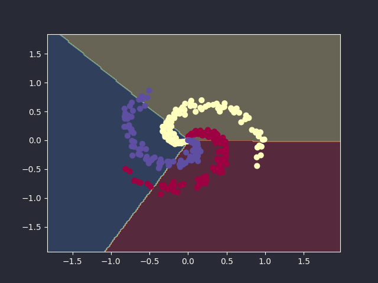

# Linear Regression

We assume a linear relationship between data $x$ and label $y$:
$$y=f(x)=wx+b$$

We call $w$ the weight and $b$ the bias.

We want the loss function $L(w, b)$ to be as small as possible:
$$L=\frac{1}{m}\sum_{i=1}^m(f^{(i)}-y^{(i)})^2=\frac{1}{m}\sum_{i=1}^m(wx^{(i)}+b-y^{(i)})^2$$

For the sake of cleaner computations, we usually divide the loss function by 2:
$$L(w,b)=\frac{1}{2m}\sum_{i=1}^m(f^{(i)}-y^{(i)})^2=\frac{1}{2m}\sum_{i=1}^m(wx^{(i)}+b-y^{(i)})^2$$

We want to find $w$ and $b$ through linear regression.

## Normal equation

$$\frac{\partial L}{\partial w}=\frac{1}{2m}\frac{\partial(\sum(wx^{(i)}+b-y^{(i)})^2)}{\partial w}=\frac{1}{m}\sum(wx^{(i)}+b-y^{(i)})x^{(i)}$$

$$\frac{\partial L}{\partial b}=\frac{1}{2m}\frac{\partial(\sum(wx^{(i)}+b-y^{(i)})^2)}{\partial b}=\frac{1}{m}\sum(wx^{(i)}+b-y^{(i)})$$

For $L$ to be minimum, the following equations must be satisfied:

$$\frac{\partial L}{\partial w}=\sum(wx^{(i)}+b-y^{(i)})x^{(i)}=0$$

$$\frac{\partial L}{\partial b}=\sum(wx^{(i)}+b-y^{(i)})=0$$

Denote

$$X=\left(\begin{matrix}1&w^{(1)} \\
1&x^{(2)} \\
1&\vdots \\
1&w^{(m)}\end{matrix}\right),\qquad W=\left(\begin{matrix}b \\
w\end{matrix}\right),\qquad y=\left(\begin{matrix}y^{(1)} \\
y^{(2)} \\
\vdots \\
y^{(m)}\end{matrix}\right)$$

The equations can be rewritten as:

$$\left(\begin{matrix}1&1&\cdots&1 \\
x^{(1)}&x^{(2)}&\cdots&x^{(m)}\end{matrix}\right)\left(\begin{matrix}b+wx^{(1)}-y^{(1)} \\
b+wx^{(2)}-y^{(2)} \\
\vdots \\
b+wx^{(m)}-y^{(m)}\end{matrix}\right)=0$$

$$X^T(XW-y)=0$$

$$X^XW=x^Ty$$

$$W=(X^X)^{-1}X^Ty$$

Therefore,

$$\left(\begin{matrix}b \\
w\end{matrix}\right)=(X^X)^{-1}X^Ty$$

### Example
We have a small dataset:


We can use normal equation to find $w$ and $b$ in $f(x)=wx+b$ that best fit the data:
```python
X = np.ones((len(train_x), 2))
X[:, 1] = train_x
y = train_y

b, w = np.linalg.inv(X.T @ X) @ (X.T @ y)
print(f"{w=}, {b=}")
```
<details open>
<summary>Output</summary>

```
w=1.1930336441895966, b=-3.895780878311875
```

</details>


## Gradient Descent
As normal equation involves computing matrix inverse, using normal equation is slow for datasets with a lot of samples or a lot of features. Instead, we can apply gradient descent algorithm to find the minimum for the loss function $L$.

Starting from $(w_0, b_0)$, the update formulae:
$$w:=w-\alpha\frac{\partial L}{\partial w}$$
$$b:=w-\alpha\frac{\partial L}{\partial b}$$

Denote

$$x=
 \begin{pmatrix}
 x^{(1)} \\
 x^{(2)} \\
 \vdots \\
 x^{(m)} \\
 \end{pmatrix}
 ,\qquad y=
 \begin{pmatrix}
 y^{(1)} \\
 y^{(2)} \\
 \vdots \\
 y^{(m)} \\
 \end{pmatrix}
 ,\qquad b=
 \begin{pmatrix}
 b \\
 b \\
 \vdots \\
 b \\
 \end{pmatrix} $$

We can write
$$\frac{\partial L}{\partial w}=\text{mean}((wx+b-y)\odot x)$$
$$\frac{\partial L}{\partial b}=\text{mean}(wx+b-y)$$

Code to use gradient descent algorithm to solve linear regression:
```python
def linear_regression(x, y, w, b, alpha=0.01, iterations=100, epsilon=1e-9):
    history = []
    for _ in range(iterations):
        dw = np.mean((w * x + b - y) * x)
        db = np.mean(w * x + b - y)
        if abs(dw) < epsilon and abs(db) < epsilon:
            break
        w -= alpha * dw
        b -= alpha * db
        history.append([w, b])
    return history
```

### Example
Continuing from our previous example, we can use gradient descent to find $w$ and $b$ that best fit the data:
```python
w, b = 0, 0
history = linear_regression(X, y, w, b, alpha=0.02, iterations=1000)
w, b = history[-1]
print(f"{w=}, {b=}")
```
<details open>
<summary>Output</summary>

```
w=1.1822480052540145, b=-3.7884192615511796
```

</details>


We can plot the loss function to see how the loss changes throughout the process:


# Multivariate linear regression
Assume that now our dataset has $K$ features:

$$x=\begin{pmatrix}x_1&x_2&\cdots&x_K\end{pmatrix}$$

The coefficient for each of the features can be grouped into vector form:

$$w=\begin{pmatrix}w_1&w_2&\cdots&w_K\end{pmatrix}$$

The objective function is now

$$f(x)=\left(\begin{matrix}x_1&x_2&\cdots&x_K\end{matrix}\right)\left(\begin{matrix}w_1 \\
w_2 \\
\vdots \\
w_K\end{matrix}\right)+b=xw+b$$

To simplify the equation further, we can write $b=w_0$. Let

$$w=\left(\begin{matrix}w_0&w_1&w_2&\cdots&w_K\end{matrix}\right)\text{ and }x=\left(\begin{matrix}1&x_1&x_2&\cdots&x_K\end{matrix}\right)$$

Then

$$f_w(x)=\left(\begin{matrix}1&x_1&x_2&\cdots&x_K\end{matrix}\right)\left(\begin{matrix}w_0 \\
w_1 \\
w_2 \\
\vdots \\
w_K\end{matrix}\right)=xw$$

If we have $m$ number of data points in the dataset, we can put them into a matrix:

$$X=\left(\begin{matrix}x^{(1)} \\
x^{(2)} \\
\vdots \\
x^{(m)}\end{matrix}\right)=\left(\begin{matrix}x_0^{(1)}&x_1^{(1)}&\cdots&x_K^{(1)} \\
x_0^{(2)}&x_1^{(2)}&\cdots&x_K^{(2)} \\
\vdots&\vdots&&\vdots \\
x_0^{(m)}&x_1^{(m)}&\cdots&x_K^{(m)}\end{matrix}\right)$$

$$f_w(X)=Xw$$

The loss function is the same as before:
$$L(w)=\frac{1}{2m}\sum_{i=1}^m(f_w(x^{(i)})-y^{(i)})^2$$
We want to find the minimum solution $w^\ast$ for the loss function. It must satisfy for all $j$:
$$\left.\frac{\partial L(w)}{\partial w_j}\right|_{w^\ast}=0$$

## Normal equation
Let $f^{(i)}=f_w(x^{(i)})=x^{(i)}w$ and $\delta^{(i)}=f^{(i)}-y^{(i)}$. By Chain rule,

$$\begin{aligned}\frac{\partial L(w)}{\partial\delta^{(i)}}&=\sum_{i=1}^m\frac{\partial L(w)}{\partial\delta^{(i)}}\times\frac{\partial\delta^{(i)}}{\partial f^{(i)}}\times\frac{\partial f^{(i)}}{\partial w_j} \\
&=\frac{1}{m}\sum_{i=1}^m\delta^{(i)}\times1\times x_j^{(i)} \\
&=\frac{1}{m}\sum_{i=1}^m(f^{(i)}-y^{(i)})x_j^{(i)} \\
&=\frac{1}{m}\sum_{i=1}^m(f_w(x^{(i)}-y^{(i)})x_j^{(i)} \\
&=\frac{1}{m}\left(\begin{matrix}x_j^{(1)}&x_j^{(2)}&\cdots&x_j^{(m)}\end{matrix}\right)\left(\begin{matrix}f_w(x^{(1)})-y^{(1)} \\
f_w(x^{(2)})-y^{(2)} \\
\vdots \\
f_w(x^{(m)})-y^{(m)}\end{matrix}\right) \\
&=\frac{1}{m}\left(\begin{matrix}x_j^{(1)}&x_j^{(2)}&\cdots&x_j^{(m)}\end{matrix}\right)\left(\begin{matrix}x^{(1)}w-y^{(1)} \\
x^{(2)}w-y^{(2)} \\
\vdots \\
x^{(m)}w-y^{(m)}\end{matrix}\right) \\
&=\frac{1}{m}X_{:,j}^T(Xw-y)\end{aligned}$$

We therefore have $\frac{\partial L(w)}{\partial w_j}=\frac{1}{m}X_{:,j}^T(Xw-y)$. The gradient of $L$ with respect to $w$ is:

$$\nabla L(w)=\left(\begin{matrix}\frac{\partial L(w)}{\partial w_1},\cdots,\frac{\partial L(w)}{\partial w_j},\cdots\end{matrix}\right)^T=\frac{1}{m}X^T(Xw-y)$$

To make $\nabla L(w)=0$,

$$\begin{aligned}\nabla L(w)&=0 \\
X^T(Xw-y)&=0 \\
w&=(X^TX)^{-1}X^Ty\end{aligned}$$

### Example
We can create a toy dataset sampled from $z=3x+2y+c$.
```python
n_points = 20
a, b, c = 3, 2, 5
x_range, y_range, noise = 5, 5, 3

xs = np.random.uniform(-x_range, x_range, n_points)
ys = np.random.uniform(-y_range, y_range, n_points)
zs = xs * a + ys * b + np.random.normal(scale=noise)
```


Finding the best matching plane with linear regression:
```python
X = np.hstack((np.ones((len(xs), 1), dtype=xs.dtype), xs[:, None], ys[:, None]))
y = zs
w = np.linalg.inv(X.T @ X) @ (X.T @ y)
residual = np.linalg.norm(y - X @ w)
print(f"Resulting plane: z = {w[1]}x + {w[2]}y + {w[0]}")
print(f"Error: {residual}")
```
<details open>
<summary>Output</summary>

```
Resulting plane: z = 3.0000000000000013x + 2.0y + 2.7025678477932398
Error: 2.1214267520435092e-14
```

</details>


## Gradient Descent
Again, normal equation is slow for big datasets as it involves computing the matrix inverse. A better approach is gradient descent (with momentum):
```python
def linear_regression_vec(X, y, alpha, num_iters, gamma=0.8, epsilon=1e-8):
    history = []
    X = np.hstack((np.ones((X.shape[0], 1), dtype=X.dtype), X))
    num_features = X.shape[1]
    v = np.zeros(num_features)
    w = np.zeros(num_features)
    for _ in range(num_iters):
        predictions = X @ w
        errors = predictions - y
        gradient = X.T @ errors / len(y)
        if np.max(np.abs(gradient)) < epsilon:
            break
        v = gamma * v + alpha * gradient
        w = w - v
        history.append(w)
    return history
```

### Example
```python
X = np.hstack((xs[:, None], ys[:, None]))
y = zs
history = linear_regression_vec(X, y, alpha=0.02, num_iters=100)
print("w:", history[-1])
```
<details open>
<summary>Output</summary>

```
w: [2.70253309 3.00003097 1.99999585]
```

</details>


The loss value decreases over time:


# Caveats
We have a slightly more complicated dataset:


Using linear regression to fit the dataset:
```python
X, y = x_train, y_train
history = linear_regression_vec(X, y, alpha=0.001, num_iters=5000)
print("w:", history[-1])
```
<details open>
<summary>Output</summary>

```
w: [13.0879035   0.36777923]
```

</details>


Clearly, using a linear function to fit the data is not the best choice for this dataset. This is a phenomenon called underfitting when we use a too simple model. We can use more complex models such as polynomial functions to represent non-linear relationships. We now assume

$$f(x)=w_3x^3+w_2x^2+w_1x+w_0=\begin{pmatrix}1&x&x^2&x^3\end{pmatrix}\begin{pmatrix}w_0&w_1&w_2&w_3\end{pmatrix}^T=xw$$

We try to solve it:
```python
X = np.hstack((X, X**2, X**3))
history = linear_regression_vec(X, y, alpha=0.001, num_iters=5000)
print("w:", history[-1])
```
<details open>
<summary>Output</summary>

```
w: [nan nan nan nan]
```

</details>


We can see from the result that it did not converge. This is because the values in our features are large, causing the large gradients.

## Standardization
One solution to the above caveat is standardization.

$$x\leftarrow\frac{x-\text{mean}(x)}{\text{std}(x)}$$

```python
mean = np.mean(X, axis=0)
std = np.std(X, axis=0)
X = (X - mean) / std
history = linear_regression_vec(X, y, alpha=0.3, num_iters=30000)
print("w:", history[-1])
```
<details open>
<summary>Output</summary>

```
w: [11.21758932 11.33617058  7.61835033  2.39058388]
```

</details>


## Underfitting and Overfitting
We create a toy dataset with sine curve:


We try to fit the data with different degree of polynomials:
```python
for i, K in enumerate([0, 1, 3, 9]):
    X = np.array([np.power(x, k) for k in range(K + 1)]).T
    w = np.linalg.inv(X.T @ X) @ (X.T @ y)
    print(f"w for {K}-degree polynomial:", w)
```
<details open>
<summary>Output</summary>

```
w for 0-degree polynomial: [-0.19410186]
w for 1-degree polynomial: [ 1.167293   -2.40352288]
w for 3-degree polynomial: [ -0.69160733  14.4684786  -40.54048788  27.82130232]
w for 9-degree polynomial: [   -4600.08666992    77664.484375    -534895.          1933308.75
 -3850268.          3721949.           -50730.         -3526218.
  3143019.          -909766.875     ]
```

</details>


We can see from the plots that 0- and 1-degree polynomials underfits the data, while 9-degree polynomial overfits the training data: it fits the training data very well, while it cannot predict well for other unseen data.

One of the ways to combat the overfitting problem it to increase the training data size. Here, we re-train the 9-degree polynomial linear regression model with more data:


In general, there are a few ways to relieve the underfitting issue:
1. Increase number of features
2. Increase the complexity of model

A few ways to solve the overfitting issue:
1. Increase training dataset size
2. Reduce the complexity of model: use a simpler model
3. Regularization: will be described below

## Regularization
Weights having huge magnitudes is a overfitting indication. In regularization, we penalize large weights in the loss function:

$$L(x;w)=\frac{1}{2m}\sum_{i=1}^m\|x^{(i)}w-y^{(i)}\|^2+\lambda\|w^2\|$$

As our objective is to minimize the loss function, the regularization term $\lambda\|w^2\|$ would need to be minimized. $\lambda$ is a regularization hyperparameter. The larger the $\lambda$ is, the stronger the effect of the regularization term becomes, and the smaller the weight $w$ remains.

The gradient of our new loss function becomes:

$$\nabla L(w)=\frac{1}{m}\sum_{i=1}^m(x^{(i)}w-y^{(i)})x^{(i)}+2\lambda w$$

```python
def gradient_descent_reg(X, y, reg, alpha, num_iters, gamma=0.8, epsilon=1e-8):
    w_history = []
    X = np.hstack((np.ones((X.shape[0], 1), dtype=X.dtype), X))
    num_features = X.shape[1]
    v = np.zeros_like(num_features)
    w = np.zeros(num_features)
    for _ in range(num_iters):
        gradient = X.T @ (X @ w - y) / len(y) + 2 * reg * w
        if np.max(np.abs(gradient)) < epsilon:
            break
        v = gamma * v + alpha * gradient
        w = w - v
        w_history.append(w)
    return w_history
```

We now use it to fit our 9-degree polynomial linear regression model:
```python
x_train_n = np.hstack(tuple(x_train ** (i + 1) for i in range(9)))
train_means = x_train_n.mean(axis=0)
train_stdevs = np.std(x_train_n, axis=0, ddof=1)
x_train_n = (x_train_n - train_means) / train_stdevs

history = gradient_descent_reg(x_train_n, y_train, reg=0.2, alpha=0.3, num_iters=100000)
print("w:", history[-1])
```
<details open>
<summary>Output</summary>

```
w: [8.0125638  5.77020132 3.33374366 3.45447778 2.09236532 2.04302421
 1.33515407 1.19533911 0.85628787 0.68738516]
```

</details>


We can see that the weights in our trained model is much smaller than before, yet it is able to produce a good result, relieving the overfitting problem.

# Logistic Regression
In linear regression, the target values are continuous. However, sometimes our target values have to be discrete. For example in classification problems, we have to group a point into a class. We can consider logistic regression as an extension of linear regression, specializing in binary classification problems.

Logistic regression sets the value of $f_w(x)$ to be between 0 and 1, representing the probability of $x$ being in a class. If we use $f_w(x)$ to represent the probability of $x$ being class $y=1$, then the probability of $x$ being class $y=0$ is $1-f_w(x)$.

$$P(y=1|x)=f_w(x)=\frac{1}{1+e^{-xw}}=\sigma(xw)$$

$$P(y=0|x)=1-f_w(x)=1-\frac{1}{1+e^{-xw}}=1-\sigma(xw)$$

For a data $x$, it has a $P(y=1|x)$ probability of being $y=1$, and a $P(y=0|x)$ probability of being $y=0$. We can say that it has a probability of $P(y=1|x)^yP(y=0|x)^{1-y}=f_w(x)^y(1-f_w(x))^{1-y}$ being sample $(x,y)$. For a dataset with $m$ samples, the probability of forming an exact dataset is
$$\prod_{i=1}^m\left(f_w(x^i)^{y^i}(1-f_w(x^i))^{1-y^i}\right)$$

We want to find the $w$ that makes the dataset most likely to happen. By taking logarithm, it is equivalent to maximizing:
$$\sum_{i=1}^m\left(y^i\log(f_w(x^i))+(1-y^i)\log(1-f_w(x^i))\right)$$

Hence, our loss function can be written as:
$$L(w)=-\frac{1}{m}\sum_{i=1}^m\left(y^i\log(f_w(x^i))+(1-y^i)\log(1-f_w(x^i))\right)$$

$-\left(y^i\log(f_w(x^i))+(1-y^i)\log(1-f_w(x^i))\right)$ is known as the cross-entropy loss. Only when the predicted value $f_w(x^i)$ for a sample $x^i$ matches its label $y^i$ can the cross-entropy loss becomes 0.

To find the minimum of $L(w)$, we need gradient descent, thus we need to know how to find the gradient of $L(w)$. Denote
$$z^i=w\odot x^i,\quad f^i=\sigma(z^i),\quad L^i=-\left(y^i\log(f^i)+(1-y^i)\log(1-f^i)\right)$$
Then
$$L(w)=\frac{1}{m}\sum_{i=1}^mL^i$$

For a given $i$ and $j$,
$$\frac{\partial L(w)}{\partial L^i}=\frac{1}{m}$$
$$\frac{\partial L^i}{\partial f^i}=-\left(\frac{y^i}{f^i}-\frac{1-y^i}{1-f^i}\right)=\frac{f^i-y^i}{f^i(1-f^i)}$$
$$\frac{\partial f^i}{\partial z^i}=\sigma(z^i)(1-\sigma(z^i))=f^i(1-f^i)$$
$$\frac{\partial z^i}{\partial w_j}=x_j^i$$

$$\begin{aligned}\frac{\partial L(w)}{\partial w_j}&=\sum_{i=1}^m\frac{\partial L(w)}{\partial L^i}\times\frac{\partial L^i}{\partial f^i}\times\frac{\partial f^i}{\partial z^i}\times\frac{\partial z^i}{\partial w_j} \\
&=\frac{1}{m}\sum_{i=1}^m\frac{f^i-y^i}{f^i(1-f^i)}\times f^i(1-f^i)\times x_j^i \\
&=\frac{1}{m}\sum_{i=1}^m(f^i-y^i)x_j^i \\
&=\frac{1}{m}\sum_{i=1}^mx_j^i(f_w(x^i)-y^i)\end{aligned}$$

$$\begin{aligned}\nabla_w L(w)&=\begin{bmatrix}\frac{\partial L(w)}{\partial w_0}&\frac{\partial L(w)}{\partial w_1}&\frac{\partial L(w)}{\partial w_2}&\cdots&\frac{\partial L(w)}{\partial w_n}\end{bmatrix} \\
&=\begin{bmatrix}\frac{1}{m}\sum_{i=1}^mx_0^i(f_w(x^i)-y^i)&\frac{1}{m}\sum_{i=1}^mx_1^i(f_w(x^i)-y^i)&\cdots&\frac{1}{m}\sum_{i=1}^mx_n^i(f_w(x^i)-y^i)\end{bmatrix} \\
&=\frac{1}{m}\sum_{i=1}^m\begin{bmatrix}x_0^i(f_w(x^i)-y^i)&x_1^i(f_w(x^i)-y^i)&\cdots&x_n^i(f_w(x^i)-y^i)\end{bmatrix} \\
&=\frac{1}{m}\sum_{i=1}^m\begin{bmatrix}x_0^i&x_1^i&\cdots&x_n^i\end{bmatrix}(f_w(x^i)-y^i) \\
&=\frac{1}{m}\sum_{i=1}^m(f_w(x^i)-y^i)x^i\\&=\frac{1}{m}\begin{bmatrix}f_w(x^1)-y^1&f_w(x^2)-y^2&\cdots&f_w(x^m)-y^m\end{bmatrix}\begin{bmatrix}x^1 \\
x^2 \\
\vdots \\
x^m\end{bmatrix} \\
&=\frac{1}{m}(f_w(x)-y)^TX=\frac{1}{m}(\sigma(Xw)-y)^TX\end{aligned}$$

We can also add a regularization term in the loss function:
$$L(w)=-\frac{1}{m}\sum_{i=1}^m\left(y^i\log(f_w(x^i))+(1-y^i)\log(1-f_w(x^i))\right)+\lambda\|w\|^2$$
Correspondingly, the gradient of $L(w)$ with respect to $w$ is
$$\nabla_wL(w)=\frac{1}{m}(f-y)^TX+2\lambda w=\frac{1}{w}(\sigma(Xw)-y)^TX+2\lambda w$$

We have another simple toy dataset:


Logistic regression implementation with regularization and momentum:
```python
def gradient_descent_logistic_reg(
    X, y, lambda_, alpha, num_iters, gamma=0.8, epsilon=1e-8
):
    w_history = []
    X = np.hstack((np.ones((X.shape[0], 1), dtype=X.dtype), X))
    num_features = X.shape[1]
    v = np.zeros_like(num_features)
    w = np.zeros(num_features)
    for _ in range(num_iters):
        gradient = (sigmoid(X @ w) - y).T @ X / len(y)
        gradient += 2 * lambda_ * w
        if np.max(np.abs(gradient)) < epsilon:
            break
        v = gamma * v + alpha * gradient
        w = w - v
        w_history.append(w)
    return w_history
```

Apply logistic regression model onto our toy dataset:
```python
w_history = gradient_descent_logistic_reg(
    X, y, lambda_=0.0, alpha=0.01, num_iters=10000
)
w = w_history[-1]
print("w:", w)
```
<details open>
<summary>Output</summary>

```
w: [11.3920102  -0.55377808 -0.83931251]
```

</details>


## Decision boundary
We use $f_w(x)=0.5$ to separate the two classes. This is equivalent to $xw=0$.

Our dataset is in two dimensions, so we can write the decision boundary as $w_0+w_1x_1+w_2x_2=0$. Given $w$ and $x_1$, we can find $x_2=-w_0/w_2-w_1x_1/w_2$.

```python
x1 = np.array([X[:, 0].min() - 1, X[:, 0].max() + 1])
x2 = -w[0] / w[2] - x1 * w[1] / w[2]
ax[0].plot(x1, x2, color="k", ls="--", lw=2)
```


# Softmax Regression
Logistic regression can solve binary classification problems, but in many situations, we have to deal with multi-class classification problems, such as digit recognition. Logistic regression only outputs a value representing whether a data is more likely to be in one class than the other. In softmax regression, it can output the same number of numbers as the number of classes available, each representing the probability of the data belonging to the class.

## Softmax function
Let $z=\left(z_1\quad z_2\quad z_3\quad \cdots\quad z_c\right)$. Let $f$ be the the softmax function. Then
$$f_i=\frac{e^{z_i}}{\sum_{k=1}^C e^{z_k}}$$

To prevent overflow and maintain numerical stability, we can divide both the numerator and denominator by $e^{\max(z)}$:
$$f_i=\frac{e^{z_i-\max(z)}}{\sum_{k=1}^Ce^{z_k-\max(z)}}$$

```python
def softmax(x):
    a = np.max(x, axis=-1, keepdims=True)
    e_x = np.exp(x - a)
    return e_x / np.sum(e_x, axis=-1, keepdims=True)
```

```python
z = np.array([3.0, 1.0, 2.0])
print(f"softmax([3.0, 1.0, 2.0]) =\n{softmax(z)}")

z = np.array([[1, 2, 3], [6, 2, 4]])
print(f"softmax([[1, 2, 3], [6, 2, 4]]) =\n{softmax(z)}")
```
<details open>
<summary>Output</summary>

```
softmax([3.0, 1.0, 2.0]) =
[0.66524096 0.09003057 0.24472847]
softmax([[1, 2, 3], [6, 2, 4]]) =
[[0.09003057 0.24472847 0.66524096]
 [0.86681333 0.01587624 0.11731043]]
```

</details>


To determine the gradient of $f(z)=\text{softmax}(z)$ with respect to $z$, let $a_i=e^{z_i}$ and $b=\sum_{k=1}^Ce^{z_k}$. Then we have the following properties:

$$\begin{aligned}\frac{\partial a_i}{\partial z_i}&=\frac{\partial e^{z_i}}{\partial z_i}=e^{z_i}=a_i \\
\frac{\partial a_i}{\partial z_j}&=\frac{\partial e^{z_i}}{\partial z_j}=0 \\
\frac{\partial b}{\partial z_i}&=\frac{\partial (\sum_{k=1}^C e^{z_k})}{\partial z_i}=e^{z_i}=a_i\end{aligned}$$

As $f_i=\frac{a_i}{b}$,

$$\begin{aligned}\frac{\partial f_i}{\partial z_i}&=\frac{\frac{\partial a_i}{\partial z_i}\cdot b-a_i\frac{\partial b}{\partial z_i}}{b^2}=\frac{a_ib-a_ia_i}{b^2}=\frac{a_i}{b}\left(1-\frac{a_i}{b}\right)=f_i(1-f_i)=f_i-f_if_i \\
\frac{\partial f_i}{\partial z_j}&=\frac{\frac{\partial a_i}{\partial z_j}\cdot b-a_i\frac{\partial b}{\partial z_j}}{b^2}=\frac{0-a_ia_j}{b^2}=-f_if_j \\
\frac{\partial f}{\partial z}&=\begin{pmatrix}f_1-f_1f_1&-f_1f_2&\cdots&-f_1f_C \\
-f_2f_1&f_2-f_2f_2&\cdots&-f_2f_C \\
\vdots&\vdots&\vdots&\vdots \\
-f_Cf_1&-f_Cf_2&\cdots&f_C-f_Cf_C\end{pmatrix}\end{aligned}$$

We can use outer product to simplify the equation:

$$f\otimes f=\begin{pmatrix}f_1f_1&f_1f_2&\cdots&f_1f_C \\
f_2f_1&f_2f_2&\cdots&f_2f_C \\
\vdots&\vdots&\vdots&\vdots \\
f_Cf_1&f_Cf_2&\cdots&f_Cf_C\end{pmatrix}$$

```python
def softmax_gradient(z):
    f = softmax(z)
    grad = -np.outer(f, f) + np.diag(f.flatten())
    return grad
```

If we know the gradient of a variable $L$ with respect to $f$ ($\nabla_f L=\frac{\partial L}{\partial f}$), then we can find the gradient of $L$ with respect to $z$ by:
$$\nabla_zL=\frac{\partial L}{\partial z}=\frac{\partial L}{\partial f}\frac{\partial f}{\partial z}$$

```python
def softmax_backward(z, df):
    grad = softmax_gradient(z)
    return df @ grad
```

```python
z = np.array([[1, 2]])
print(f"gradient of softmax(z) =\n{softmax_gradient(z)}")
df = np.array([1, 3])  # gradient of L w.r.t. f
print(f"dL/dz =\n{softmax_backward(z, df)}")
```
<details open>
<summary>Output</summary>

```
gradient of softmax(z) =
[[ 0.19661193 -0.19661193]
 [-0.19661193  0.19661193]]
dL/dz =
[-0.39322387  0.39322387]
```

</details>


## Softmax regression model
When we are facing a classification problem that has 3 classes, we can pass through 3 linear regression functions, then their outputs are passed through a softmax function, producing 3 numbers between 0 and 1. It also has the property of $\sum_{i=1}^3=1$.


Similar to what we have done in linear regression, we treat $b_i$ as $w_{0i}$ and $x=\left(1\quad x_1\quad x_2\quad x_3\right)$. Then the softmax regression function is

$$f(x)=\text{softmax}(xW_{,1},xW_{,2},xW_{,3})=\text{softmax}(xW)$$

where

$$W_{,i}=\begin{pmatrix}w_{0i} \\
w_{1i} \\
w_{2i} \\
w_{3i}\end{pmatrix}$$

$f_j$ represents the probability of $x$ belonging to class $j$. If the ground truth of label $(x^{(i)},y^{(i)})$ is $y^{(i)}=2$, then the probability of that sample belonging to class 2 is $f_2$, which is $f_{y^{(i)}}$.

For a dataset with $m$ samples, write

$$Z=XW=\begin{pmatrix}z^{(1)} \\
z^{(2)} \\
\vdots \\
z^{(m)}\end{pmatrix}=\begin{pmatrix}x^{(1)}W \\
x^{(2)}W \\
\vdots \\
x^{(m)}W\end{pmatrix}$$

We can combine all $f^{(i)}$ into a matrix $F$:

$$F=\begin{pmatrix}f^{(1)} \\
f^{(2)} \\
\vdots \\
f^{(m)}\end{pmatrix}=\begin{pmatrix}\frac{e^{z_1^{(1)}}}{\sum_{i=1}^Ce^{z_i^{(1)}}}&\frac{e^{z_2^{(1)}}}{\sum_{i=1}^Ce^{z_i^{(1)}}}&\cdots&\frac{e^{z_C^{(1)}}}{\sum_{i=1}^Ce^{z_i^{(1)}}} \\
\frac{e^{z_1^{(2)}}}{\sum_{i=1}^Ce^{z_i^{(2)}}}&\frac{e^{z_2^{(2)}}}{\sum_{i=1}^Ce^{z_i^{(2)}}}&\cdots&\frac{e^{z_C^{(2)}}}{\sum_{i=1}^Ce^{z_i^{(2)}}} \\
\vdots&\vdots&\vdots&\vdots \\
\frac{e^{z_1^{(m)}}}{\sum_{i=1}^Ce^{z_i^{(m)}}}&\frac{e^{z_2^{(m)}}}{\sum_{i=1}^Ce^{z_i^{(m)}}}&\cdots&\frac{e^{z_C^{(m)}}}{\sum_{i=1}^Ce^{z_i^{(m)}}}\end{pmatrix}$$

The target values of the samples can be represented by $y$:

$$y=\begin{pmatrix}y^{(1)} \\
y^{(2)} \\
\vdots \\
y^{(m)}\end{pmatrix}$$

Denote $f_{y^{(i)}}^{(i)}$ as the probability of sample $i$ being in its true class $y^{(i)}$. We can use these probability to construct a vector:

$$F_y=\begin{pmatrix}f_{y^{(1)}}^{(1)} \\
f_{y^{(2)}}^{(2)} \\
\vdots \\
f_{y^{(m)}}^{(m)}\end{pmatrix}=\begin{pmatrix}\frac{e^{z_{y^{(1)}}^{(1)}}}{\sum_{i=1}^Ce^{z_i^{(1)}}} \\
\frac{e^{z_{y^{(2)}}^{(2)}}}{\sum_{i=1}^Ce^{z_i^{(2)}}} \\
\vdots \\
\frac{e^{z_{y^{(m)}}^{(m)}}}{\sum_{i=1}^Ce^{z_i^{(m)}}}\end{pmatrix}$$

## Multiclass cross entropy loss
Consider a sample $(x^{(i)},y^{(i)})$. When its feature $x^{(i)}$ passes through the softmax regression model, the output is the probabilities of that sample being classified in each class: $\left(f_1^{(i)}\quad f_2^{(i)}\quad \cdots\quad f_C^{(i)}\right)$. The probability of the sample being in class $y^{(i)}$ is $f_{y^{(i)}}^{(i)}$. If we have $m$ samples in our dataset, the probability of realizing all of them with our model is

$$\prod_{i=1}^mf_{y^{(i)}}^{(i)}$$

We want to find $W$ for the regression model to maximize this probability. This is equivalent to minimizing the following loss function:

$$L(W)=-\frac{1}{m}\sum_{i=1}^m\log\left(f_{y^{(i)}}^{(i)}\right)$$

We say that $-\log\left(f_{y^{(i)}}^{(i)}\right)$ is the cross entropy loss for sample $i$.

```python
def cross_entropy(F, y):
    m = len(F)  # number of samples
    log_Fy = -np.log(F[range(m), y])
    return np.sum(log_Fy) / m
```
```python
F = np.array([[0.2, 0.5, 0.3], [0.2, 0.6, 0.2]])
Y = np.array([2, 1])
print(cross_entropy(F, Y))
```
<details open>
<summary>Output</summary>

```
0.8573992140459634
```

</details>


Sometimes, we use a one-hot vector $y^{(i)}=\left(y_1^{(i)}\quad y_2^{(i)}\quad \cdots\quad y_C^{(i)}\right)$ instead of an integer to represent the class for a sample. In that case, the cross entropy loss for that sample is:

$$-\log\left(f_j^{(i)}\right)=-y_j^{(i)}\log\left(f_j^{(i)}\right)=-\sum_{j=1}^Cy_j^{(i)}\log\left(f_j^{(i)}\right)$$

The cross entropy loss function for all samples is:

$$L(W)=-\frac{1}{m}\sum_{i=1}^m\sum_{j=1}^Cy_j^{(i)}\log\left(f_j^{(i)}\right)=-\frac{1}{m}\text{np.sum}\left(Y\odot\log(F)\right)$$

```python
def cross_entropy_one_hot(F, Y):
    m = len(F)
    return -np.sum(Y * np.log(F)) / m
```
```python
F = np.array([[0.2, 0.5, 0.3], [0.2, 0.6, 0.2]])
Y = np.array([[0, 0, 1], [0, 1, 0]])
print(cross_entropy_one_hot(F, Y))
```
<details open>
<summary>Output</summary>

```
0.8573992140459634
```

</details>


Given a dataset with multiple samples $Z$, with their classification labels $y$, we can compute the cross entropy loss for the softmax regression model:
```python
def softmax_cross_entropy(Z, y):
    m = len(Z)
    F = softmax(Z)
    log_Fy = -np.log(F[range(m), y])
    return np.sum(log_Fy) / m
```
```python
Z = np.array([[2, 25, 13], [54, 3, 11]])
y = np.array([2, 1])
print(softmax_cross_entropy(Z, y))
```
<details open>
<summary>Output</summary>

```
31.500003072148047
```

</details>


For one-hot vector label representation, the implementation is just the following:
```python
def softmax_cross_entropy_one_hot(Z, y):
    F = softmax(Z)
    loss = -np.sum(y * np.log(F), axis=1)
    return np.mean(loss)
```
```python
Z = np.array([[2, 25, 13], [54, 3, 11]])
y = np.array([[0, 0, 1], [0, 1, 0]])
print(softmax_cross_entropy_one_hot(Z, y))
```
<details open>
<summary>Output</summary>

```
31.500003072148047
```

</details>


## Softmax regression gradient

### Cross entropy loss gradient with respect to weighted sum $z$

Continuing with our 3-class classification problem. Suppose we have sample $(x,y)$. $f(x)=\text{softmax}(xW)$ can be viewed as the composite function of $z=(z_1\quad z_2\quad z_3)=(xW_{,1}\quad xW_{,2}\quad xW_{,3})$ and $f(z)=\text{softmax}(z)$.

Let $a=(a_1\quad a_2\quad a_3)=(e^{z_1}\quad e^{z_2}\quad e^{z_3})$. Then

$$f(z)=\begin{pmatrix}f_1 & f_2 & f_3\end{pmatrix}=\begin{pmatrix}\frac{a_1}{a_1+a_2+a_3}&\frac{a_2}{a_1+a_2+a_3}&\frac{a_3}{a_1+a_2+a_3}\end{pmatrix}$$

$$L=-\log(f_y)=-(\log(a_y)-\log(a_1+a_2+a_3))$$

$$\begin{aligned}\frac{\partial L}{\partial z_i}&=-\frac{1}{a_y}\frac{\partial a_y}{\partial z_i}-\frac{1}{a_1+a_2+a_3}\left(\frac{\partial a_1}{\partial z_i}+\frac{\partial a_2}{\partial z_i}+\frac{\partial a_3}{\partial z_i}\right) \\
&=-\frac{1}{a_y}\frac{\partial a_y}{\partial z_i}-\frac{1}{a_1+a_2+a_3}e^{z_i} \\
&=-\frac{1}{a_y}\cdot 1(y==i)e^{z_y}-\frac{1}{a_1+a_2+a_3}e^{z_i} \\
&=-1(y==i)+\frac{e^{z_i}}{\sum_{j=1}^3 e^{z_j}} \\
&=f_i-1(y==i)\end{aligned}$$

Therefore, the gradient of $L$ with respect to $z=(z_1\quad z_2\quad z_3)$ is

$$\nabla_z L=\left(\frac{\partial L}{\partial z_1}\quad \frac{\partial L}{\partial z_2}\quad \frac{\partial L}{\partial z_3}\right)=\left(f_1-1(y==1)\quad f_2-1(y==2)\quad f_3-1(y==3)\right)$$

If the class of the sample is $i$, then

$$\nabla_z L=\begin{pmatrix}f_1&f_2&\cdots&f_i-1&\cdots&f_C\end{pmatrix}=f-I_i$$

where $I_i$ is a one-hot vector: the $i$-th element is 1, and other elements are 0.

If the $y$ is already in one-hot vector representation, then $y=I_i$ and $\nabla_z L=f-y$.

Now denote $L$ as the total cross entropy loss for all samples, and $Z$ is the feature matrix for all samples, we have

$$\nabla_ZL=F-Y$$

This matches the gradient of the loss function $\frac{1}{2}\|F-Y\|^2$ from linear regression.

```python
def grad_softmax_cross_entropy(Z, y):
    F = softmax(Z)
    F[range(len(Z)), y] -= 1
    return F / len(Z)
```

```python
Z = np.array([[2.0, 25.0, 13.0], [54.0, 3.0, 11.0]])
y = np.array([2, 1])
print("grad_softmax_cross_entropy:\n", grad_softmax_cross_entropy(Z, y))
```

We can verify the output with `numerical_gradient` that we implemented [last chapter](../gradient_descent/README.md):
```python
def loss_f():
    return softmax_cross_entropy(Z, y)


print("numerical_gradient:\n", numerical_gradient(loss_f, [Z]))
```

<details open>
<summary>Output</summary>

```
grad_softmax_cross_entropy:
 [[ 5.13090829e-11  4.99996928e-01 -4.99996928e-01]
 [ 5.00000000e-01 -5.00000000e-01  1.05756552e-19]]
numerical_gradient:
 [array([[ 0.        ,  0.49999693, -0.49999693],
       [ 0.5       , -0.5       ,  0.        ]])]
```

</details>


One-hot vector version:
```python
def grad_softmax_cross_entropy_one_hot(Z, y):
    F = softmax(Z)
    return (F - y) / len(Z)
```

### Cross entropy loss gradient with respect to weight parameter $W$

As $z_i=xW_{,i}$, its gradient with respect to $W_{,i}$ is $x$, and its gradient with respect to $W_{,j}$ is 0 for $i\neq j$. Hence,

$$\frac{\partial z_i}{\partial W_{,j}}=1(i==j)x$$

$$\frac{\partial L}{\partial W_{,j}}=\sum_{i=1}^3\frac{\partial L}{\partial z_i}\frac{\partial z_i}{\partial W_{,j}}=\frac{\partial L}{\partial z_j}\frac{\partial z_j}{\partial W_{,j}}=(f_j-1(y==j))x$$

Note: As $W_{,i}$ is a column vector, if $x$ is a row vector, in order to make $\frac{\partial L}{\partial W}$ the same shape as $W$:

$$\begin{aligned}\frac{\partial L}{\partial W}&=\left(\frac{\partial L}{\partial W_{,1}}^T,\frac{\partial L}{\partial W_{,2}}^T,\cdots,\frac{\partial L}{\partial W_{,C}}^T\right) \\
&=x^T(f_1-1(y==1),f_2-1(y==2),\cdots,f_C-1(y==C))\end{aligned}$$

If we use one-hot vector to represent the label $y$, it can be simplified as:

$$\frac{\partial L}{\partial W}= x^T(f-y)$$

For dataset with $m$ samples:

$$X=\begin{bmatrix}x^{(1)} \\
x^{(2)} \\
\vdots \\
x^{(i)} \\
\vdots \\
x^{(m)}\end{bmatrix}$$

$F$ and $Y$ are constructed from their respective prediction value and labels:

$$F=\begin{bmatrix}f^{(1)} \\
f^{(2)} \\
\vdots \\
f^{(i)} \\
\vdots \\
f^{(m)}\end{bmatrix},\quad Y=\begin{bmatrix}y^{(1)} \\
y^{(2)} \\
\vdots \\
y^{(i)} \\
\vdots \\
y^{(m)}\end{bmatrix}$$

Then the cross entropy loss function's gradient with respect to $W$ is:

$$\frac{\partial L}{\partial W}=X^T(F-Y)$$

If we add regularization term into cross entropy loss function,

$$L(W)=-\frac{1}{m}\sum_{i=1}^m\log\left(f_{y^{(i)}}^{(i)}\right)+\lambda\|W\|^2$$

If one-hot vector is used to represent the label,

$$L(W)=-\frac{1}{m}\sum_{i=1}^my^{(i)}\log\left(f^{(i)}\right)+\lambda\|W\|^2$$

The cross entropy loss function's gradient with respect to $W$ is:

$$\frac{\partial L}{\partial W}=X^T(F-Y)+2\lambda W$$

```python
def gradient_softmax(W, X, y, reg):
    Z = X @ W
    I_i = np.zeros_like(Z)
    I_i[np.arange(len(Z)), y] = 1
    F = softmax(Z)
    grad = np.dot(X.T, F - I_i) / len(X) + 2 * reg * W
    return grad
```

```python
def loss_softmax(W, X, y, reg):
    Z = X @ W
    Z_i_y_i = Z[np.arange(len(Z)), y]
    negative_log_prob = -Z_i_y_i + np.log(np.sum(np.exp(Z), axis=-1))
    loss = np.mean(negative_log_prob) + reg * np.sum(W * W)
    return loss
```

One-hot representation version:
```python
def gradient_softmax_onehot(W, X, y, reg):
    Z = X @ W
    F = softmax(Z)
    grad = np.dot(X.T, F - y) / len(X) + 2 * reg * W
    return grad
```

Example:
```python
X = np.array([[2, 3], [4, 5]])
y = np.array([2, 1])
W = np.array([[0.1, 0.2, 0.3], [0.4, 0.2, 0.8]])
reg = 0.2
print(f"{gradient_softmax(W,X,y,reg) = }")
print(f"{loss_softmax(W,X,y,reg) = }")
# one-hot representation
X = np.array([[2, 3], [4, 5]])
y = np.array([[0, 0, 1], [0, 1, 0]])
print(f"{gradient_softmax_onehot(W,X,y,reg) = }")
print(f"{loss_softmax_onehot(W,X,y,reg) = }")
```
<details open>
<summary>Output</summary>

```
gradient_softmax(W,X,y,reg) = array([[ 0.30213245, -1.75779321,  1.69566076],
       [ 0.5254108 , -2.19194012,  2.22652932]])
loss_softmax(W,X,y,reg) = 2.086304963628266
gradient_softmax_onehot(W,X,y,reg) = array([[ 0.30213245, -1.75779321,  1.69566076],
       [ 0.5254108 , -2.19194012,  2.22652932]])
loss_softmax_onehot(W,X,y,reg) = 2.0863049636282662
```

</details>


## Softmax regression gradient descent

```python
def gradient_descent_softmax(
    w, X, y, reg=0.0, alpha=0.01, iterations=100, epsilon=1e-8
):
    X = np.hstack((np.ones((X.shape[0], 1), dtype=X.dtype), X))
    w_history = []
    for i in range(iterations):
        gradient = gradient_softmax(w, X, y, reg)
        if np.max(np.abs(gradient)) < epsilon:
            print("gradient is small enough!")
            print("iterated num is :", i)
            break
        w = w - (alpha * gradient)
        w_history.append(w)
    return w_history
```

Example: spiral dataset

```python
X_spiral, y_spiral = gen_spiral_dataset()
```


```python
w = np.zeros([X_spiral.shape[1] + 1, len(np.unique(y_spiral))])
w_history = gradient_descent_softmax(
    w, X_spiral, y_spiral, reg=1e-3, alpha=1.0, iterations=200
)
w = w_history[-1]
```

<details open>
<summary>Output</summary>

```
Accuracy: 0.5166666666666667
```

</details>




As you can see, softmax gradient descent is fundamentally a linear model.
